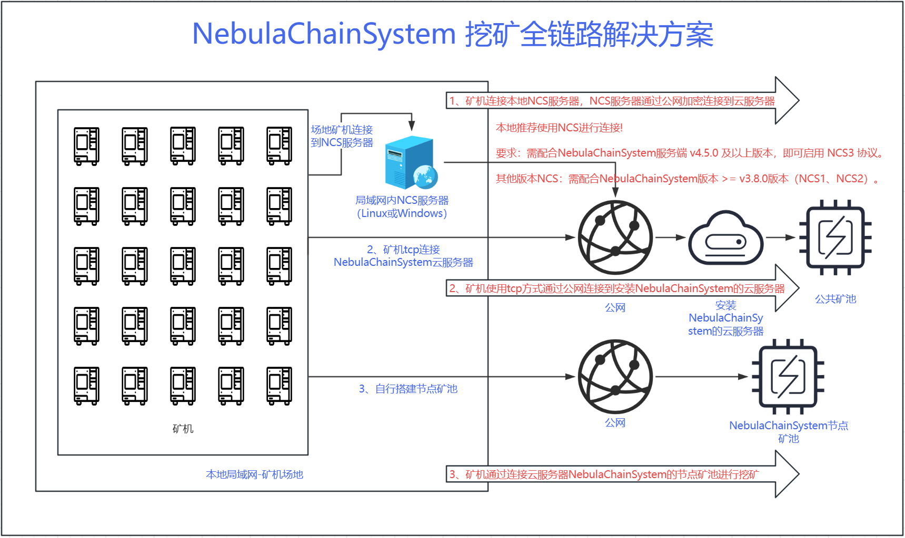

# NebulaChain-System Mining Solution

### A full chain solution for mining virtual currencies

<ul>
    <li>
        Agent software for mining machine operation and maintenance, management, mine pool node acceleration and user-defined service fees
        <ul>
            <li>
                <a href="https://github.com/BernieMacMillan/NebulaChainSystem" target="_blank">NebulaChain-System</a>
            </li>
            <li>
                
            </li>
        </ul>
    </li>
    <li>
        Local protocol conversion tool that can compress public network traffic by 1000%–2000%, limit any specified number of public connections, and effectively resist man-in-the-middle attacks.
        <ul>
            <li>
                <a href="https://github.com/BernieMacMillan/NCS" target="_blank">NCS3</a>
            </li>
            <li>
                <a href="https://github.com/BernieMacMillan/NCS/tree/main/NCS_2" target="_blank">NCS2</a>
            </li>
        </ul>
    </li>
    <li>
        NebulaChain-System distributed ore pool, build your own ore pool node.
        <ul>
            <li>
                <a href="https://berniemacmillan.gitbook.io/berniemacmillan/cheng-wei-kuang-chi-jie-dian" target="_blank">
                    Node Pool
                </a>
            </li>
            <li>
                <a href="https://berniemacmillan.gitbook.io/berniemacmillan/kuang-chi-jie-dian-yong-hu-duan-api" target="_blank">
                    Pool API
                </a>
            </li>
        </ul>
    </li>
    <li>
关于
        <ul>
            <li>
                
            </li>
            <li>
                
            </li>
        </ul>
    </li>
</ul>

# NebulaChain-System 挖矿全链路解决方案

### 用于挖掘数字虚拟货币的全链路解决方案

<ul>
    <li>
        矿机运维、管理、矿池节点加速、用户自定义服务费用代理软件
        <ul>
            <li>
                <a href="https://github.com/BernieMacMillan/NebulaChainSystem" target="_blank">NebulaChain-System</a>
            </li>
            <li>
                
            </li>
        </ul>
    </li>
    <li>
        本地协议转换工具，可将公网流量压缩1000%–2000%，限制任意指定数量的公网连接，有效抵御中间人攻击。
        <ul>
            <li>
                <a href="https://github.com/BernieMacMillan/NCS" target="_blank">NCS3</a>
            </li>
            <li>
                <a href="https://github.com/BernieMacMillan/NCS/tree/main/NCS_2" target="_blank">NCS2</a>
            </li>
        </ul>
    </li>
    <li>
        NebulaChain-System分布式矿池，构建自己的分布式节点矿池。
        <ul>
            <li>
                <a href="https://berniemacmillan.gitbook.io/berniemacmillan/cheng-wei-kuang-chi-jie-dian" target="_blank">
                    节点矿池
                </a>
            </li>
            <li>
                <a href="https://berniemacmillan.gitbook.io/berniemacmillan/kuang-chi-jie-dian-yong-hu-duan-api" target="_blank">
                    矿池API
                </a>
            </li>
        </ul>
    </li>
    <li>
关于
        <ul>
            <li>
                
            </li>
            <li>
                
            </li>
        </ul>
    </li>
</ul>

  

